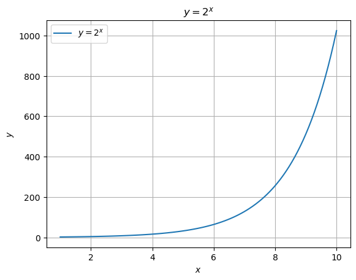
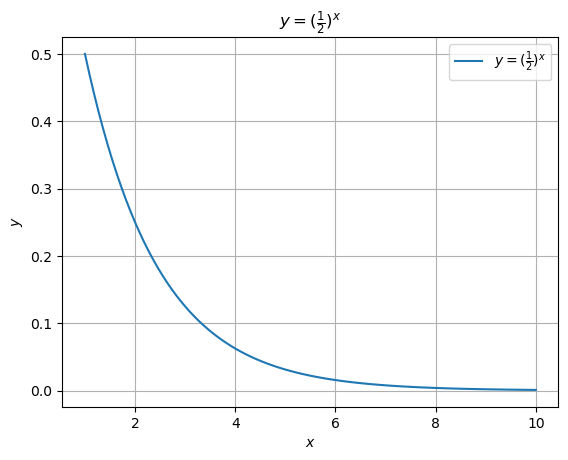
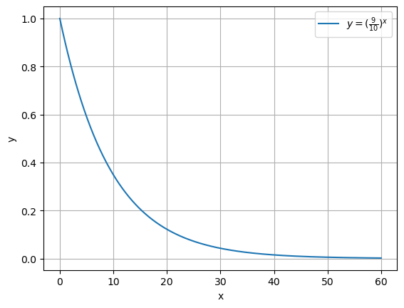
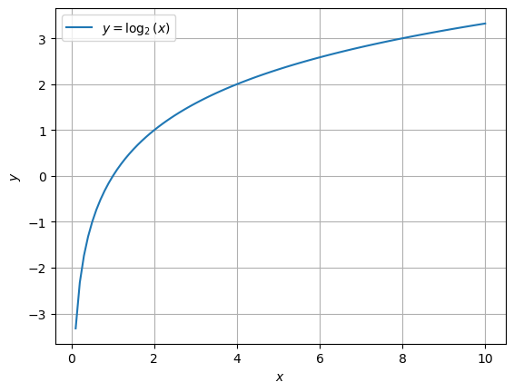
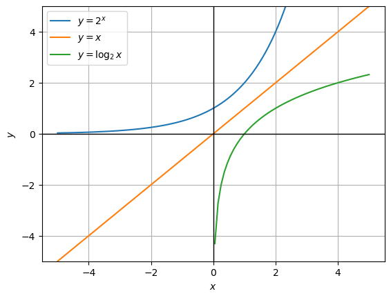
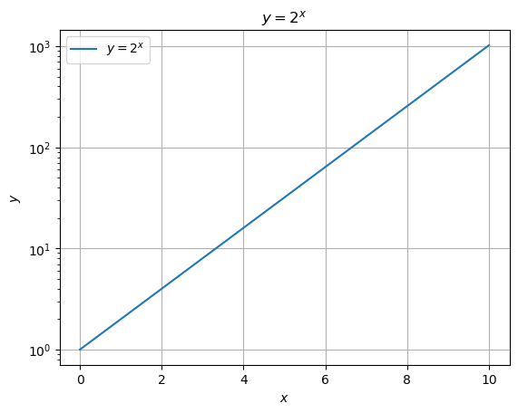
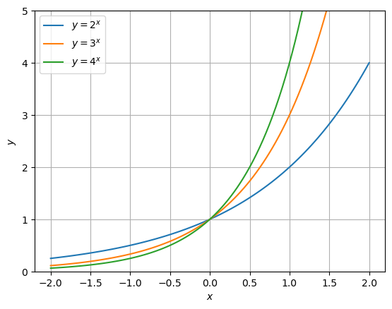

# 「文系のためのめっちゃやさしい対数」山本昌宏 監修 NEWTON PRESS

2023-11-12 ~ 11-14

## 指数 ドでかい数をあつかうときの便利道具

§１.ものすごい数を掛け算であらわす

指数も対数も掛け算の回数をあらわしている

対数はもともとは、船乗りの命を救うために生まれた

- 約400年前の大航海時代
- 船の正確な位置を知るには膨大な計算が必要だった
- 対数を使うと複雑な掛け算が簡単な足し算へと変化
- 計算尺...1970年代まで技術者の必需品だった
  - アポロ11号
  - 風立ちぬ（スタジオジブリ）

観測可能な宇宙の直径は1000000000000000000000000000m = $10^{27}m$

地球の直径は約13000000m = $1.3\times10^7m$

同じ数をくりかえし掛け算する回数のことを「指数」という。  
一方、くりかえし掛け算される数を「底」といい、テイと読む。

水素原子の原子核の直径は0.000000000000001m = $(\frac{1}{10})^{15}m$  
(小数点以下に0が14個)

$(\frac{1}{10})^{15} = 10^{-15}$

1粒の米が毎日倍になると、30日で536,870,912粒（約200俵）に  

掛け算を繰り返すことを累乗という  
非常に急激に増加することを指数関数的な増加などとも表現する

0.1ミリの厚さの紙を42回折ると月まで届く  

ギターの弦は1.06倍の掛け算でできている  
弦の長さが1.06倍になるごとに、音の高さが半音ずつ下がる  
音が1オクターブ上がると弦が1秒間に振動する回数は2倍になる  
この1秒間の振動の回数を振動数という  
振動数は弦の長さで決まる  
高いドと低いドの弦の振動する部分の長さは2倍違う  
1オクターブは12の半音に分けられている  
ド ド＃ レ レ＃ ミ ファ ファ＃ ソ ソ＃ ラ ラ＃ シ  
$1.06^{12} = 2.012...$  

§２. 爆発的な増加をグラフにしてみよう

細菌の分裂  
$y = 2^x$  
$y$は細菌の個数、$x$は経過時間を表す  
このような数式を指数関数という  
関数というのは、ある数を入れると、中でなんらかの計算をして、その計算結果を返してくれる"機械"のようなもの

```python
x = np.linspace(1, 10, 100)
y = 2 ** x
```

```python
plt.plot(x, y, label='$y = 2^x$')
plt.xlabel('$x$')
plt.ylabel('$y$')
plt.title('$y = 2^x$')
plt.grid(True)
plt.legend()
plt.show()
```



この化石はいつのもの？  
化石の年代測定  
炭素14年代測定  
炭素14は放射性物質で、放置しておくと、だんだん崩壊して窒素原子に変化する  
炭素14の原子の集団が崩壊していき、全体として元の$\frac{1}{2}$の数になる期間のことを半減期という  
最初の炭素14の量を1とすると、半減期$x$回分の期間が経過した後の炭素14の量は$y = (\frac{1}{2})^x$という式であらわせる  

炭素14の半減期は約5730年なので、これを元に化石がいつごろの生物のものだったのかを推測する

海の中の明るさだって、指数でわかる  
水深と明るさの関係も指数関数であらわせる  
1メートルもぐるごとに明るさが$\frac{9}{10}$倍になるとすると  
水深$x$mのところの明るさ$y$は、$y = (\frac{9}{10})^x$であらわせる  


利子の計算をやってみよう  
利子のつけ方には単利法と複利法の2種類がある  
単利法は元金にだけ利子がつく  
複利法では「元金 ＋ 前の期間までに生じた利子」に利子がつく  
複利法は指数関数で計算する  
元金を$a$、年利率を$r$とすると$n$年後の元金と利子との合計金額は、  
$a\times(1+r)^n$となる  
70の法則  
$70\div$年利率(%)でおよそ2倍になる年数が分かる  

指数の表記をはじめて使ったのは哲学者デカルト  
ルネ・デカルト(1596~1650)  

## 指数と表裏一体の「対数」

§1. 身近にあふれる「掛け算の回数」

対数は掛け算をする数(底)と掛け算をくりかえした結果(真数)がわかっているとき、そのくりかえしの掛け算の回数をあらわすもの

10を底とする1000の対数は3  

1等星と6等星の明るさは100倍ちがう  
イギリスの天文学者ノーマン・ポグソン(1829~1891)が星の光の量を測定し、1等星は6等星の約100倍の光の量であることを発見  
ポグソンの発見を元に、  
6等星の光の量を1とすると、
5等星の光の量は約2.5、  
4等星の光の量は約6.3($2.5^2$)、  
3等星の光の量は約15.6($2.5^3$)、  
2等星の光の量は約39($2.5^4$)、
1等星の光の量は約100($2.5^5$)となるように星の等級が決められた  

地震のマグニチュード７と9のエネルギーは1000倍違う  
マグニチュードは地震のエネルギーが約32倍になったときに、値が1大きくなるように決められている  
マグニチュードの値が1あがると地震のエネルギーは約32倍、2上がると約1000倍($\fallingdotseq32^2$)もの違いがでる  

pH7の水道水とpH5の酸性雨の濃度の違いは100倍  
pHは0~14までの値をとって0に近づくほど酸性が強く、14に近いほどアルカリ性が強い  
pH7が中性  
レモンの果汁は酸性が強くpH2~3  
pHの数値は水溶液に溶けている水素イオンの濃度によって決まっている  
水素イオンの濃度が高いとpHは低くなり酸性  
水素イオンの濃度が低いとpHは高くなりアルカリ性  
pH0の水溶液には1リットルあたり1モルの水素イオンが溶けている  
$1モル = 約6.02\times10^{23}個$  
pH1の水溶液には0.1($10^{-1}$)モル、  
pH14の水溶液には$10^{-14}$モルの水素イオンが溶けている  

音の大きさは掛け算の回数が大事  
音の正体は空気の振動  
空気の振動の強さ(音圧)をあらわすのにパスカル(Pa)という単位が使われる  
普通の会話は$10^{-2}$Pa、  
地下鉄のホームは1Pa、  
ジェット機のエンジン音は10Paぐらい  
感覚的にはそれほど音の大きさに差がなくても音圧であらわすとものすごい差がある  
そこで、デシベル(dB)という単位を使うと音圧をより人の感覚に近くなるようにあらわすことができる  
普通の会話60dB、  
地下鉄のホーム100dB、  
ジェット機のエンジン音120dB  
デシベルは音圧が$10^{-5}$Paのときを0デシベルとし、音圧が10倍になるごとに20デシベル増えるように定められている  
$10^{-4}$Pa = 20dB  
$10^{-3}$Pa = 40dB  
$10^{-2}$Pa = 60dB  
$10^{-1}$Pa = 80dB  
1Pa = 100dB  
10Pa = 120dB  

§2.計算をラクにするために生まれた対数

$\log_28=3$

底が10の対数は常用対数とよばれよく利用される  
$\log_{10}1000=3$  

対数と指数は、表裏一体の関係だった！  

天文学者と船乗りを救った対数  
複雑な計算をラクにするために対数は生まれた  
1594年ごろスコットランドの数学者ジョン・ネイピア(1550~1611)によって対数は考え出された  
対数の性質を使うと複雑な掛け算を簡単な足し算に変換することができる  

$y=\log_2x$のグラフ  


指数関数と対数関数は、$y=x$のグラフをはさんで線対象になる  

指数関数と対数関数は、$x$と$y$を入れ替えた関係  
このような関係にある関数のことを「逆関数」という  

細菌の増殖も対数を使えば一目瞭然  
対数グラフとは、横軸や縦軸に対数目盛を使ったグラフ  


株価の変化を対数目盛で見てみよう！  
縦軸の値が1目盛りごとに10倍になる対数目盛が一般的によく使われている  
対数グラフは、絶対的な大きさに関係なく、相対的な変化が見えやすくなる  

軸の一方だけに対数目盛を撮っているグラフを片対数グラフといい、縦軸と横軸の両方に対数目盛をとっているグラフを両対数グラフという  

## もっと指数と対数にくわしくなる

§１.指数の計算をマスターしよう！

【指数の法則①】累乗の掛け算は、足し算で計算  
$2^2\times2^3=2^{2+3}=2^5$  
$a^m\times a^n=a^{m+n}$  
底が異なるときは使えない  

【指数の法則②】かっこの指数は、指数を掛け算  
$(2^3)^4=2^{3\times 4}=2^{12}$  
$(a^m)^n=a^{m\times n}$  

【指数の法則③】かっこの指数は、中身の全部につける  
$(2\times 3)^4 = 2^4\times 3^4$  
$(a\times b)^m = a^m\times b^m$  

§２.いろんな指数を考えよう！

0の指数って何？  
$a^{m+n}=a^m\times a^n$  
$m=0$のとき  
$a^n=a^0\times a^n$  
$a^0=1$  
$y=a^x$のグラフでは、$a^0$はいつも1になるので、$x=0$, $y=1$の点を必ず通る  


マイナスの指数を考えよう！  
$a^{m+n}=a^m\times a^n$  
$m=-n$を代入  
$a^0=a^{-n}\times a^n$  
$1=a^{-n}\times a^n$  
$a^{-n}=\frac{1}{a^n}$

分数の指数を考えよう！  
$(a^m)^n=a^{m\times n}$  
$m=\frac{1}{n}$を代入  
$(a^{\frac{1}{n}})^n=a$
$a^\frac{1}{n}=\sqrt[n]{a}$  

$a^{\frac{m}{n}}=(a^{\frac{1}{n}})^m=\sqrt[n]{a}^m$  

指数の計算に挑戦してみよう！  

§3.対数の計算をマスターしよう！

【対数の法則①】掛け算を足し算に変換  
$\log_{10}(100\times 1,000)=\log_{10}(10^5)=5$  
$\log_{10}100=2$  
$\log_{10}1,000=3$  
$\log_{10}(100\times 1,000)=\log_{10}100+ \log_{10}1,000$  
$\log_a(M\times N)=\log_aM+\log_aN
$

【対数の法則②】割り算を引き算に変換  
$\log_{10}(100,000\div 100)=\log_{10}10^3=3$  
$\log_{10}100,000=5$  
$\log_{10}100=2$  
$\log_{10}(100,000\div100)=\log_{10}100,000-\log_{10}100$  
$\log_a(M\div N)=\log_aM-\log_aN$  

【対数の法則③】累乗を簡単な掛け算に変換  
$\log_{10}100^3=\log_{10}1,000,000=6$  
$3\times\log_{10}100=3\times 2=6$  
$\log_aM^k=k\log_aM$  

対数の計算をしてみよう  

## 対数表と計算尺を使って計算しよう

§1.複雑な掛け算が足し算になる

「常用対数表」  
左端の列 ...真数の整数部分と小数第一位  
上端の行 ...真数の小数第二位  

131✕219✕563✕608を計算してみよう

$2^{29}$を計算してみよう

12回掛け算すると、2になる数は何？

対数表を完成させたヘンリー・ブリッグス  
1614年 - ネイピアが対数を提唱  
1615年 - ネイピアに会い、底を10とする対数表の作成を提案  

§2.超便利道具「計算尺」を使ってみよう！

## 特別な数「$e$」を使う自然対数

§1.$e$はこうして見つかった

金利の計算から見つかった不思議な数「$e$」  

2.718281828459045  
鮒一鉢二鉢一鉢二鉢至極惜しい  

スイスの数学者ヤコブ・ベルヌーイ(1654-1705)が、預金額を計算するなかで、最初に見出したといわれている  

$e$は、預金額を計算するための$(1+\frac{1}{n})^n$という式から生まれた  

$n→∞$のとき、その値は$e$に収束する  

オイラーは対数から$e$にたどりついた  
スイスの天才数学者レオンハルト・オイラー(1707-1783)  
対数関数の微分との関係で$e$を考えた  

微分とは、簡単にいうと、ある関数のグラフの接線の傾きを求めること  

【$y=\log_ax$を微分した式】  
$=\frac{1}{x\log_ea}$

$e$を底とする自然対数とは  
$y=\log_ex$を微分すると$\frac{1}{x\log_ee}=\frac{1}{x}$となる  

【$y=e^x$を微分した式】  
$=e^x$  

§2.世界でもっとも美しい数式

オイラーが発見した$e$を使ったすごい数式  
【オイラーの公式】  
$e^{ix}=\cos x + i \sin x$  

虚数単位$i$を2乗すると-1になる  
$i^2 = -1$  

【オイラーの等式】  
$e^{i\pi} + 1 = 0$  

指数法則  
①$a^p\times a^q = a^{p+q}$  
②$(a^p)^q = a^{pq}$  
③$(ab)^p = a^p\times b^p$  

対数法則  
①$\log_aMN = \log_aM + \log_aN$  
②$\log_a(\frac{M}{N}) = \log_aM - \log_aN$  
③$\log_aM^k = k\log_aM$  
